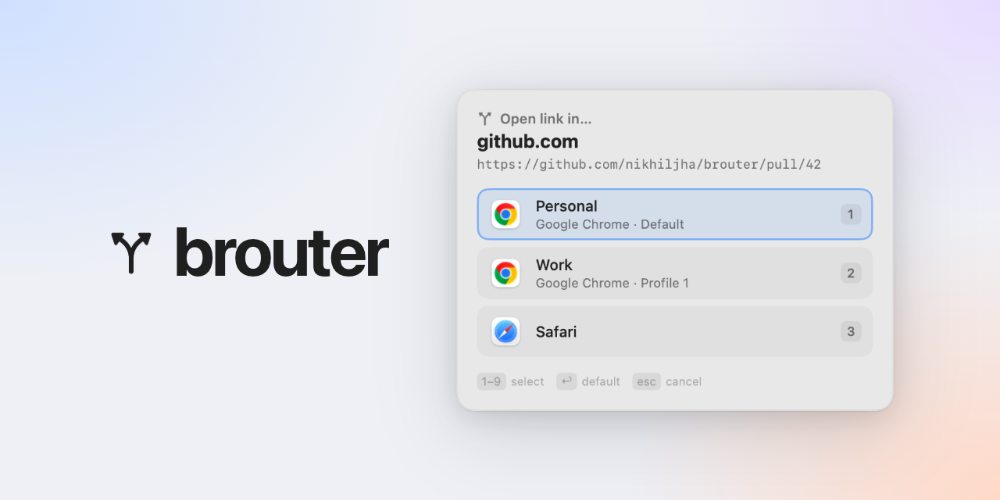

# brouter



brouter is a macOS browser router. Set it as the default browser, and a
JavaScript function decides which browser or Chrome profile opens each link. It
can also show a picker, copy a link, or send a custom-scheme link to an app.

It runs as a background agent with a menu-bar icon.

## Requirements

- macOS 13+
- Swift toolchain (Xcode or Command Line Tools)

## Install

```sh
make install       # build, install to /Applications (or ~/Applications), start the agent
make set-default   # make brouter the default http/https handler
```

Approve the macOS prompt. If `set-default` reports an error, check **System
Settings → Desktop & Dock → Default web browser**, or set brouter there.

Uninstall with `make uninstall`.

## Configure

The config is `~/Library/Application Support/brouter/config.js`. brouter
creates it on first run with the browsers it detects. It reloads the file when
it changes.

brouter uses `$BROUTER_CONFIG` if set, then the path above, then
`~/.config/brouter/config.js`. See `config.example.js` for a full example.

### Browsers

```js
const browsers = {
  personal: { app: "Google Chrome", profile: "Default",   label: "Personal" },
  work:     { app: "Google Chrome", profile: "Profile 1", label: "Work" },
  safari:   { app: "Safari" },
};
```

| Field | Description |
|---|---|
| `app` | App name, bundle ID, or path |
| `profile` | Chromium profile directory, such as `Default` or `Profile 1` |
| `args` | Extra command-line arguments |
| `label` | Name shown in the picker |

Chrome shows the profile directory at `chrome://version` under **Profile Path**.

### Routing

`route(url, ctx)` returns where a link goes. `ctx` has:

```
url, scheme, host, hostname, port, path, pathname, hash,
search, query, sourceApp { name, bundleId, path }
```

| Return value | Result |
|---|---|
| `"work"` | Open in a browser from `browsers` |
| `{ browser: "work" }` | Same as above |
| `{ app: "Safari" }` | Open in an app not listed in `browsers` |
| `{ copy: true }` | Copy the URL to the clipboard |
| `{ ask: true }` | Pick from all browsers |
| `{ ask: ["work", "personal"] }` | Pick from these options |
| `{ ask: { options, message, default } }` | Pick with a custom message and default |
| Nothing | Open in the first browser, or Safari |

`ask` options can be browser keys, `{ browser: "key" }`, app targets, or
`{ copy: true }`. `default` is an option index or browser key.

```js
function route(url, ctx) {
  const is = (d) => ctx.host === d || ctx.host.endsWith("." + d);

  if (is("github.com")) return "work";
  if (ctx.sourceApp?.bundleId === "com.tinyspeck.slackmacgap") return "work";
  if (is("zoom.us")) return { ask: { options: ["work", "personal"], default: "work" } };
  return "personal";
}
```

`console.log()` writes to the brouter log.

### Custom URL schemes

To handle links such as `myapp://...`, list their schemes in `schemes`, then
route them in `route()`. This example asks whether to copy the link or open it
in the app:

```js
const schemeHandlers = [
  {
    schemes: ["myapp"],
    target: { app: "com.example.myapp", label: "Open in My App" },
  },
];
const schemes = schemeHandlers.flatMap(h => h.schemes);

function route(url, ctx) {
  const handler = schemeHandlers.find(h => h.schemes.includes(ctx.scheme));
  if (handler) {
    return { ask: { options: [{ copy: true }, handler.target], default: 0 } };
  }
  return "personal";
}
```

Scheme names are case-insensitive and have no `:` or `//`. `ctx.scheme` is
lowercase.

After changing `schemes`, reinstall and register them:

```sh
make install
/Applications/brouter.app/Contents/MacOS/brouter register-schemes
```

Approve the macOS prompt. If a scheme doesn't switch, quit the app that owns
it and try again. brouter can only handle schemes listed in `schemes`; macOS
has no catch-all handler.

Removing a scheme from `schemes` does not give it back to its original app. Set
the handler back first.

## Picker

- **1–9**: choose an option
- **Return**: choose the default
- **Esc** or click outside: cancel

Preview it with `swift run brouter ask-demo`.

## Menu bar

- **Smart Config**: open a coding agent to edit the config, or copy a prompt for one
- **Manual Config**: open, reveal, copy the path of, or reload the config
- **Detected Browsers**: click a profile to copy its config key
- **Quit brouter**: stop the agent until the next link or login

Option-click the icon to show the version and config status.

## CLI

```sh
brouter route <url>          # show where a URL would go
brouter open <url>           # route and open a URL
brouter validate             # check the config
brouter detect               # list installed browsers and profiles
brouter browsers             # list browsers in the config
brouter agents               # list coding agents and terminals
brouter init [--force]       # write a starter config
brouter edit                 # open the config
brouter set-default [app]    # handle http and https
brouter register-schemes [app]  # handle the schemes in the config
brouter config-path          # print the config path
```

## Development

```sh
swift test
make build
make run                          # run the agent in the foreground
make route URL=https://github.com/x/y
```

## Troubleshooting

- Logs: `~/Library/Logs/brouter.log`
- Restart: `launchctl kickstart -k gui/$(id -u)/com.nikhiljha.brouter`
- Missing from the default-browser list:
  ```sh
  /System/Library/Frameworks/CoreServices.framework/Frameworks/LaunchServices.framework/Support/lsregister -f /Applications/brouter.app
  ```
- If the config fails to load, links open in the first browser or Safari.
  `brouter validate` shows the error.
